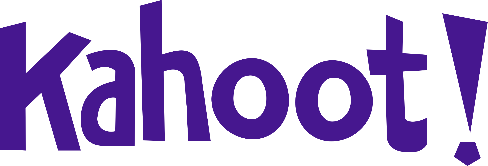
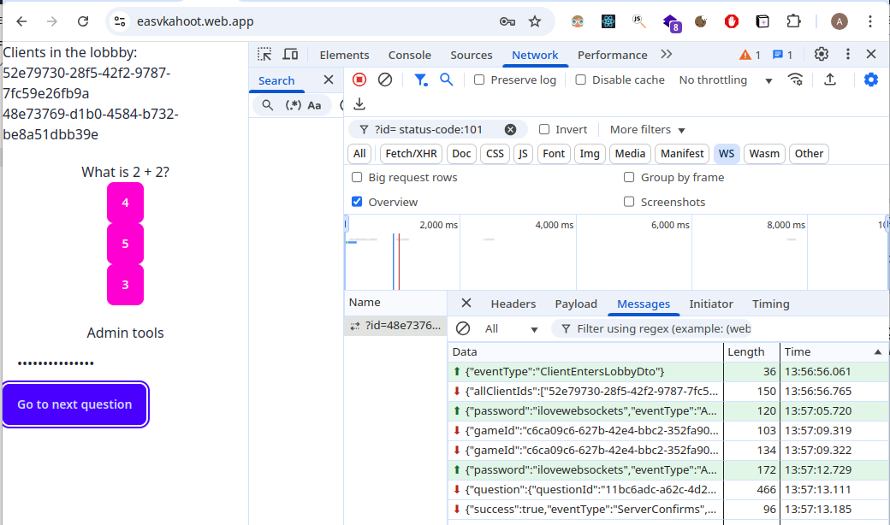

This project spans weeks 9 and 10 and concludes all websocket work.

#### Remote repo on Github: `https://github.com/uldahlalex/fs25_kahoot` 

### Agenda, Wednesday 26th of February (week 9)
- 08:15: Presentation: Project reveeal: **The Kahoot Clone** & Relevant theory
    - Presentation link: `https://docs.google.com/presentation/d/1Fjfp4FHT1ZtFiEs_8sQa-VAXPOTbuQE6pqkBbDV2aG8/edit?usp=sharing`

The link to the app I demonstrated Wednesday is here: *(running deployment)* `https://easvkahoot.web.app/`

You can use it by entering the password "ilovewebsockets" and clicking start game + send question (all browsers connected to the app will play along)

You can of course inspect the browser tab to see the DTO structure I use in my solution:

### Agenda, 🎂Friday 28th of February🎂 (week 9)
- 08:15: Presentation
    - Deployment of WebSocket APIs
    - Unit testing with real networking
    - NSwag TS generator
    - Various configuration & template handout
- 09:00: One of two of you will help me pick up and carry cake from Højvangs bakery next to the school
- 09:15: We eat cake and program awesome kahoot clone

### Starter template link: `https://github.com/uldahlalex/kahoot_template`

##### The template contians the following:
- README.md instructions to add environment variables / secrets
- YML files to deploy client + server app + run tests
- NSwag configuration to generate Typescript types based on your DTOs
- WsClientProvider with appropriate URL based on development/production
- Testing setup with real websocket networking client and usage example
- IConnectionManager implementation
- Entity Framework setup for the Kahoot schema
- Options pattern configuration

So in other words, it does *not* contain all the event handlers / business logic / UI components required to solve the task - **only the boilerplate/configuration that you write once and (mostly) never change.**
____

### Agenda, week 10
- There will be no presentations any of the days in week 10: Just pure workshop. I will of course be available for assistance.

# The Kahoot Clone Assignment

## Features

The following Kahoot-like features must be implemented:
- When arriving on the "landing page", clients are added to a lobby
- When the admin "starts" a game, all the clients in the lobby are added to the game-room
- Questions are broadcasted by the admin to all clients in the gameroom (beginning of a new "round").
    - Players send ansers to the server during the question phase of the round.
    - After a certain time-delay, the "results" of the round is broadcasted by the server, and the question phase is over.
    - The answers are displayed in the "results" phase.

## Implementation details

- Data should be saved.
    - You must store peristed data in a relational database (like this one `https://aiven.io/free-postgresql-database`).
    - Temporary WebSocket state can be stored in ConcurrentDictionaries

## Tips

- You may build you own "ConnectionManager" from scratch or use a generalized solution I have here: `https://gist.github.com/uldahlalex/a75d4dc99c3cfb99b15a8db4a4af90ba` which can be used for a lot of different business cases including this one.
- You may build your own database schema from scratch or use the one I used in my demo: `https://gist.github.com/uldahlalex/dedc2736839d4f72a5f09aa1c5f6d1d0`
    - The ID's are all text (with no fancy auto-generate, so I recommend you just make GUID's in C# and cast .ToString() before saving)

## Project wrap-up

The format has recently been changed: Now I do a walkthrough of how to solve the exercise + you will have chance to share your solutions / implementation proposals.